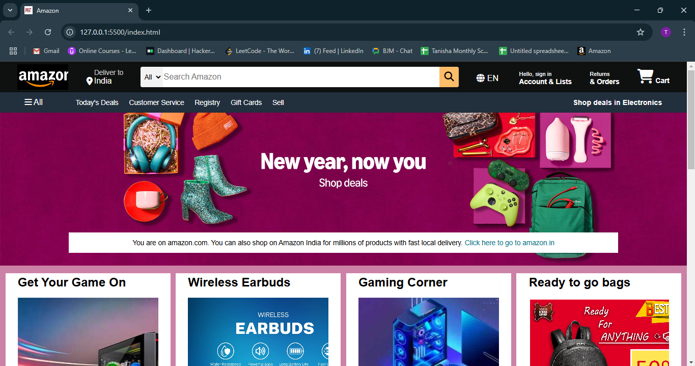
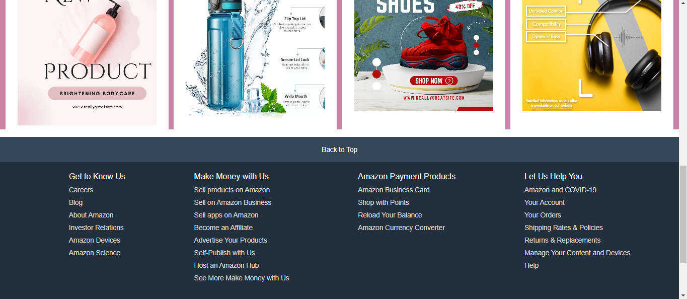

<h1>Amazon Website Clone (HTML & CSS Only)</h1>
This project is a basic clone of the popular Amazon website, built using only HTML and CSS. While it is not fully functional due to the absence of JavaScript, it replicates the layout and styling of Amazon's interface. Additional functionalities can be implemented as needed.

<h4>Preview of the Clone:</h4>
Here are some screenshots showcasing the design:

 

<h4>Get Involved</h4>
Thank you for checking out this project! Feel free to modify, enhance, and add new features to improve its functionality. 🚀
